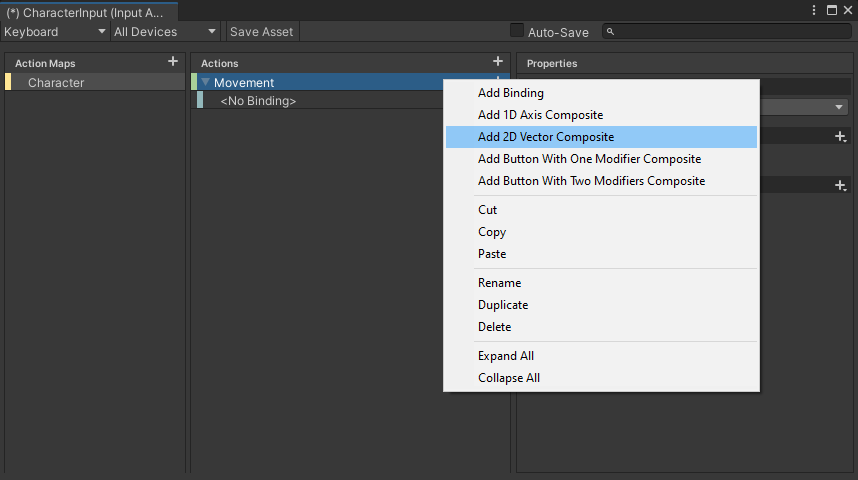
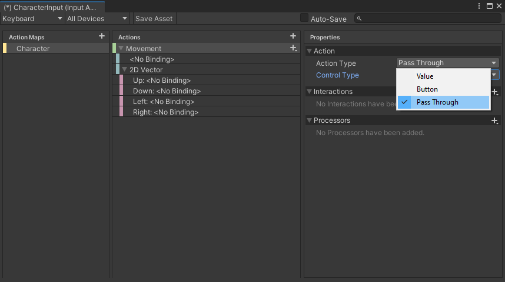
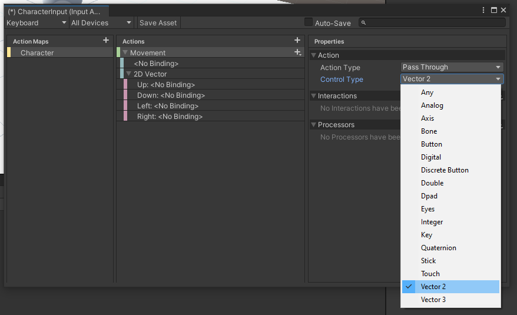

# MovementExample
Small Movement example for Unitys Input System

## Setup

First of all, create your InputAction, ActionMaps and Actions as usual. **Right click on an action** to fetch the menu and add a 2D Vector Composite Action. This menu will **not* show up if you click on the plus sign.

Switch the Action Type of your Action to `Pass Through`

Switch the Control Type of your Action to `Vector2D`

